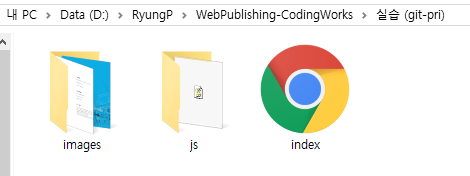
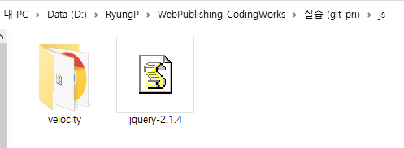
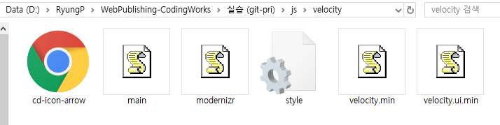

> 🎧 20.08.19  
> 🧩 인프런 - HTML+CSS+JQUERY 반응형 웹사이트 포트폴리오 ([https://inf.run/2XLx](https://inf.run/2XLx))

# Ch 1. 전체 레이아웃을 제어하는 플러그인 사용법 및 사용자 설정

 

## <1> 전체 UI UX를 제어하는 플러그인

**Page Scroll Effects** 
[https://codyhouse.co/gem/page-scroll-effects](https://codyhouse.co/gem/page-scroll-effects) 
페이지 섹션 전활할 때 어떤 이펙트를 줄지 도와줌 
종류 : ScaleDown / Gallery / Catch / Rotate / Opacity / Fixed / Parallax 
플러그인 사용을 위해 다운 받은 후에는 한데 모아 지울건 지우고 하나의 폴더로 정리(velocity) 
오픈소스인 jquery-2.1.4 파일은 밖으로 빼낸다 
그 다음 이들을 묶어 js 폴더로 만든다 
정리하자면, js 폴더 내에서 다운받게 되는 플러그인을 각각의 폴더로 나눠 구분하는 것 
 
 
 
