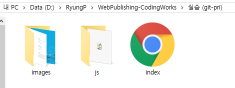
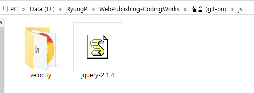
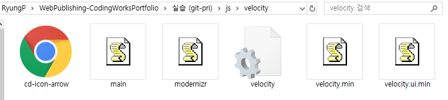

> 🎧 20.08.19 <br>
> 🧩 인프런 - HTML+CSS+JQUERY 반응형 웹사이트 포트폴리오 ([https://inf.run/2XLx](https://inf.run/2XLx))

# Ch 1. 전체 레이아웃을 제어하는 플러그인 사용법 및 사용자 설정

<br>

## <1> 전체 UI UX를 제어하는 플러그인

**Page Scroll Effects**<br>
[https://codyhouse.co/gem/page-scroll-effects](https://codyhouse.co/gem/page-scroll-effects)<br>
페이지 섹션 전활할 때 어떤 이펙트를 줄지 도와줌<br>
종류 : **ScaleDown / Gallery / Catch / Rotate / Opacity / Fixed / Parallax**<br>
플러그인 사용을 위해 다운 받은 후에는 한데 모아 지울건 지우고 하나의 폴더로 정리(*velocity*)<br>
오픈소스인 *jquery-2.1.4* 파일은 밖으로 빼낸다<br>
그 다음 이들을 묶어 *js* 폴더로 만든다<br>
정리하자면, *js* 폴더 내에서 다운받게 되는 플러그인을 각각의 폴더로 나눠 구분하는 것<br>
 <br>
 <br>
 <br>

<br><br>

*index.html*로 들어가 위의 플러그인이 제대로 연동되도록 경로를 지정해줌(css, js)<br>
```html
<!doctype html>
<html lang="ko">
<head>
  <meta charset="UTF-8">
  <meta name="viewport" content="width=device-width, initial-scale=1.0">
  <title>DesignWorks Architecture Agency</title>
  <!-- Page Scroll Effects JS & CSS -->
  <script src="js/jquery-2.1.4.js"></script>
  <script src="js/velocity/modernizr.js"></script>
  <script src="js/velocity/velocity.min.js"></script>
  <script src="js/velocity/velocity.ui.min.js"></script>
  <script src="js/velocity/main.js"></script>
  <link rel="stylesheet" href="js/velocity/velocity.css">
</head>
<body>
  ...
</body>
</html>
```

<br><br>

**하이재킹** 설정 : on / off<br>
**data-animation** 선택 : None / ScaleDown / Gallery / Catch / Rotate / Opacity / Fixed / Parallax
```html
<!-- hijacking: on/off - animation: none/scaleDown/rotate/gallery/catch/opacity/fixed/parallax -->
<body data-hijacking="on" data-animation="scaleDown">
	...
</body>
```
하이재킹은 마우스를 톡톡 건드리면 스크롤을 끌어당기듯이 예쁘게 전환되도록 함<br><br>

여기서 마우스의 강도는 *js>velocity>main.js*에서 조절<br>
```js
jQuery(document).ready(function($){
	//variables
	var hijacking= $('body').data('hijacking'),
		animationType = $('body').data('animation'),
		delta = 0,
        scrollThreshold = 1, /* 숫자를 작게하면 더 쉽게 전환됨*/
        actual = 1,
        animating = false;
...
```
<br><br>

눈으로 보기
 <br>

<br><br><br>

## <2> 전체 웹사이트 index 파일 구조 설정하고 필수 파일 링크하기

*index.html*이 있는 폴더에 *custom.js*와 *style.css*, *responsive.css*를 각각 생성<br>
*custom.js* : 따로 js를 작성<br>
*style.css* : 따로 스타일시트를 작성(PC버전)<br>
*responsive.css* : 모바일(반응형)화면 만들 때 필요한 스타일시트 따로 작성<br>
<br>
그리고 *index.html*에 연결<br><br>
```html
  ...
  <!-- Custom JS & CSS -->
  <script src="custom.js"></script>
  <link rel="stylesheet" href="style.css"> <!-- PC -->
  <link rel="stylesheet" href="responsive.css"> <!-- mobile -->
</head>
```
단, 여기서 style.css가 responsive.css 보다 상위 파일임을 인식하고(PC버전과 mobile버전의 우선순위) 경로를 지정할 때 순서에 신경쓸 것<br>
css파일과 js파일 간의 경로 지정 순서는 상관이 없음<br>
