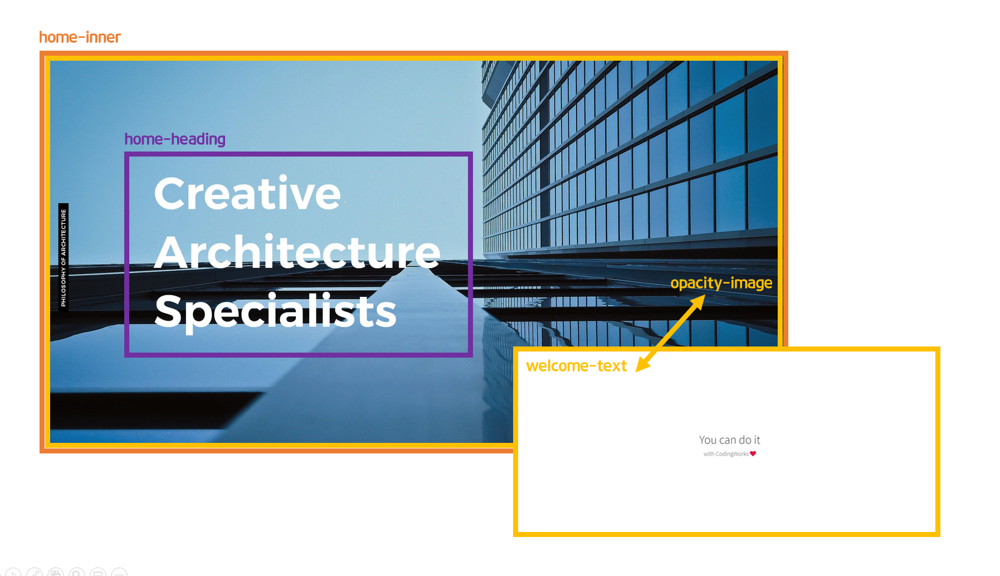
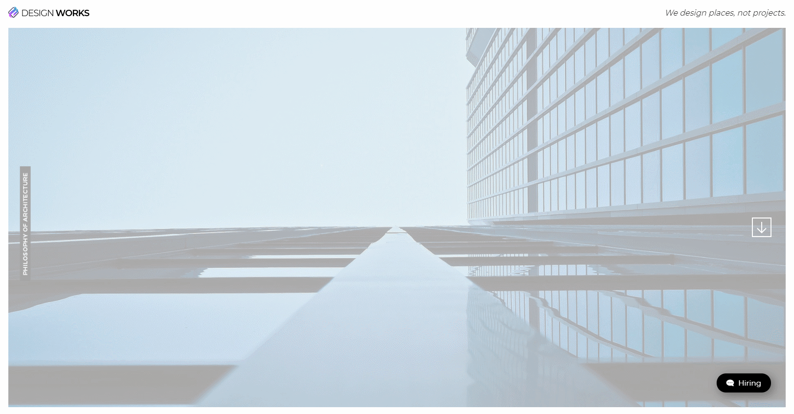

> 🎧 20.11.11 <br>
> 🧩 인프런 - HTML+CSS+JQUERY 반응형 웹사이트 포트폴리오 ([https://inf.run/2XLx](https://inf.run/2XLx))

# Ch 10. 섹션 상세 퍼블리싱(Home Section)

<br>

## <1> HTML. CSS

Home 섹션의 기본구조를 만듦<br>
<br>
<br>
전체 배경인 `opacity-image`와 로딩 화면인 `welcome-text`은 동일하게 `width:100%;`로 크기를 채운 뒤, 애니메이션을 주어 순서대로 교차되는 모습으로 만들것
<br><br>
<br>


## <2> 애니메이션

🍕 css 애니메이션 <br>
`@keyframes` : 어떤 애니메이션을 동작할지 keyframes로 제작<br>
`animation` : 제작한 애니메이션 적용<br>
```css
div {
	animation: 애니메이션명 지속시간 (시작딜레이:0s) 애니메이션타입 (무한반복:infinite);
	animation-fill-mode: both; /* 100%에서 0% 모습으로 다시 돌아가는 속성 무시 (=100% 모습 유지하며 종료)*/
	/* animation: slide 2s ease-in-out both; 로 한 줄 표현 가능 */
}
@keyframes 애니메이션명 {
	0% {css;} /* 처음: 0% */
	50% {css;}
	100% {css;} /* 마지막 : 100% */
}
```

<br>

### (1) 로딩화면(welcome-text) 밑에서 위로 나타나기

```css
.welcome-text {
	animation: slideup 2s linear;
    animation-fill-mode: both;
}

@keyframes slideup {
    0% {opacity: 0;} /* 없다가 */
    20% {opacity: 1;} /* 슬라이드해서 나타남 */
    80% {opacity: 1;} /* 상태 유지 */
    100% {opacity: 0;} /* 사라짐 */
}
```
<br>
<br>

### (2) 검은 화면 좌에서 우로 채워졌다가 다시 사라지기

```css
.home-inner:before{
	content: ''; /* :before, :after에서 필수 입력 */
    background-color: #000;
    position: absolute;
    width: 0%;
    height: 100%;
    top: 0;
    left: 0;
    animation: overlay 1s 2s ease-in-out both;
    /* slideup이 2초간 진행된 이후에 시작하기 때문에 delay: 2s */
}
@keyframes overlay {
    0% {width: 0; left: 0;} /* 없다가 */
    50% {width: 100%; left: 0;} /* 검은색으로 왼쪽부터 덮고 */
    100% {width: 0; left: 100%;} /* 오른쪽부터 검은색 제거 */
    /* 같은 속성을 연달아 쓰기를 추천하기에 right: 0;으로 쓰지 않음 */
}
```
<br>

### (3) (2)와 교차되듯이 배경 이미지(opacity-image) 나타나기

```css
.opacity-image {
    animation: opacity-image 1s 2.5s ease-in both;
    /* overlay가 진행되는 도중 부터 시작하기 때문에 delay: 2s(slideup) + 1s(overlay)/2 = 2.5s */
}
@keyframes opacity-image {
    0% {opacity: 0;} /* 없다가 */
    100% {opacity: 1;} /* 나타나기 */
}
```
<br>
<br>

### (4) 리터럴(home-heading) 상->하, 좌->우  순서대로 나타나기

```css
.home-heading {
    /* left: 40%; */
    left: 300px; /* %로 잡으면 유동적으로 움직이기 때문에 px로 고정 */ 
}
.home-heading span {
    width: 0;
    overflow: hidden;
    /* 가로를 0%로 두고 넘치는 부분 숨기기 => 안보이는 상태 */
}
.home-heading span:nth-child(1) {animation: reveal 0.5s 3.5s ease-in both;}
.home-heading span:nth-child(2) {animation: reveal 0.5s 4s ease-in both;}
.home-heading span:nth-child(3) {animation: reveal 0.5s 4.5s ease-in both;}
/* 각각의 span끼리 시작 시간을 두기 위해 nth-child 이용해서 따로 애니메이션 넣음 */
@keyframes reveal {
    0% {}
    100% {width: 100%;}
}
```
<br>
<br>
<br><br>


