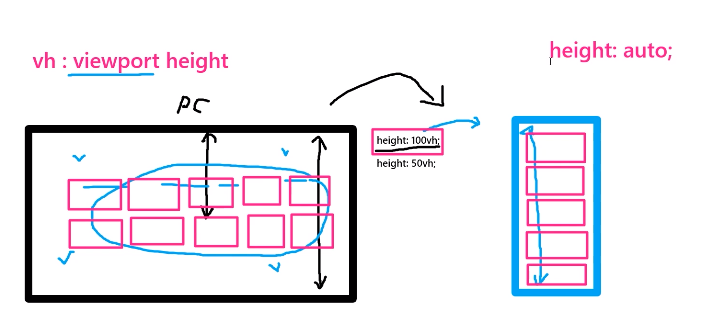
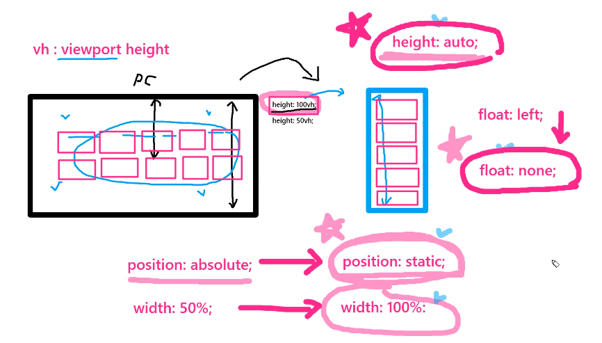
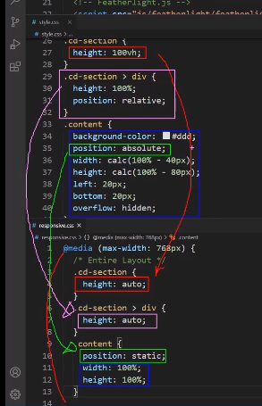

> 🎧 20.12.08 <br>
> 🧩 인프런 - HTML+CSS+JQUERY 반응형 웹사이트 포트폴리오 ([https://inf.run/2XLx](https://inf.run/2XLx))

# Ch 14. 메인페이지 모든 섹션 모바일로 변환하기

## <1> 필수 핵심 이론

### 1. height: 100vh / height: auto
```html
	<div class="container">
		<section>lorem100</section>
		<section>lorem120</section>
		<section>lorem150</section>
	</div>
```
```css
        body {margin: 0;}
        section {
            border: 5px solid red;
            /* height: auto; */
            height: 300px;
        }
        @media (max-width: 768px) {
            section {height: auto;}
        }
```
`height: auto` : 안에 있는 텍스트의 내용만큼 크기를 잡는 기본값. 자식 요소들의 높이에 따라 늘어남<br>
`height: 100px` : 높이값이 고정이 되면서 화면을 줄일 때 자식 요소들의 높이가 고정값보다 커지면 넘침<br>
=> PC버전에서는 고정값을 주다가 mobile로 들어서면 auto로 콘텐츠에 맞게 조절되는 방법 추천<br>
<br>

### 2. 배경이미지가 사용된 경우 height: auto
```html
	<div class="container">
		<section>lorem100</section>
		<section>lorem120</section>
		<section>lorem150</section>
		<section></section>
	</div>
```
```css
        body {margin: 0;}
        section {border: 5px solid red; height: 300px;}
        section:nth-child(4) {
            background: url(picture.jpg) no-repeat center center;
            background-size: cover;
        }
        @media (max-width: 768px) {
            section {height: auto;}
            section:nth-child(4) {height: 300px;}
        }
```
네번째 section의 경우 자식 콘텐츠가 없으며 배경이미지만 있는 상태. 따라서 `height: auto`를 주면 영역이 없어 아예 사라지게 됨 => 잊지 말고 높이값을 지정해줘야<br>
<br>

### 3-1. vh(viewport height)와 auto
 <br>
`height: 100vh;` : (viewport height) 강제로 height를 디바이스 화면에 맞게 100%로 만듦<br>
이런 경우 PC와 mobile 각 디바이스 화면의 크기가 다르기 때문에 PC버전에서 담았던 콘텐츠를 mobile버전에 다 담지 못하고 넘치게 됨<br>
=> 모바일 전환에서 `height: auto;` 사용<br>

### 3-2. float에서 left와 none
`float: left;` => `float: none;` : 기본값
### 3-3. width: 50%와 100%
`width: 50%;` => `width: 100%;` : 기본값
### 3-4. position: absolute와 static
`position: absolute;` => `position: static` : 기본값<br>
 <br>

<br><br>


## <2> 중요 세팅

1. style.css / responsive.css 연동 재확인
2. 이전에 모바일 변환해놓은 header, go-to-top 버튼, hiring 버튼 재확인
3. <1> 필수이론이 선제 적용됐음을 재확인
	 <br>
4. 미디어쿼리 내에서 섹션들을 전부 `display: none;` 시켜주고 하나씩 주석을 걸어 편하게 작업
	```css
	    /* Show Hide Section */
	    #home,
	    #about,
	    #project,
	    #plan,
	    #awards,
	    #location,
	    #contact {display: none;}
	``` 
5.  section 내부의 inner들을 이용해서 조정할 것
	처음에는 배경 영역이 안잡히니 height: 100vh로 눈에 보기에 만든 뒤, 작업이 끝나면 height: auto;를 주어 콘텐츠에 맞게 길이 조정<br>

<br><br>

## <3> 작업

### Home Section
```css
/* ################ Section 1 : home ################ */
.home-inner {height: 100vh;} /* 섹션 길이 화면에 맞추기 */
.welcome-text {transform: translate(-50%, -50%) scale(0.7); width: 100%;} /* 로딩텍스트 크기 변환 */
.home-heading {left: 20px;} /* 메인 텍스트 위치 맞추기 */
.home-heading span {font-size: 50px;} /* 메인 텍스트 크기 맞추기 */ 
```
### About Section
```css
/* ################ Section 2 : about ################ */
.about-inner {
	height: auto; /* 섹션 길이 컨텐츠에 맞게 */
	padding: 20px;
	background: #0dace3; /* 가독성위한 배경 이미지 제거 */
}
.about-items {
	width: 100%; /* width: 50% 해제 */
	position: static; /* position: absolute 해제 */
	transform: none; /* transform: translateY(-50%) 해제 */
	margin-left: 0px; text-align: center;
}
.about-items .item img {float: none;} /* float: left 해제 */
```
### Project Section
```css
/* ################ Section 3 : project ################ */
.project-inner {height: auto; border: none;}
.tabs .tab > div {float: none; width: 100%;} /* .project-info와 .project-photo꺼 해제 */
.project-info {padding: 20px;}
.project-info p {position: relative;}
/*
	가상 선택자로 만들어진 숫자 .project-info:before가 더 우선되어 p태그를 가리게 됨
	이를 방지하기 위해 z-index가 없는 상태에서 우선권을 획득하는 position: relative를 사용
*/
.project-info .detail div span {font-size: 13px;}
.project-info .view-project {width: 100%;}
.btn {width: 100%; bottom: 10px;} /* 버튼을 중앙에 오게 하기 위해 width: 100% */
```
### Plan Section
```css
/* ################ Section 4 : plan ################ */
.plan-inner {height: auto; padding: 20px;}
.plan-feature {width: 100%; position: static; transform: none;} /* width: 80%; position: absolute; transform: translate(-50%, -50%); 해제*/
.plan-feature > div {height: auto;} /* height: 300px 해제 */
.plan-info {margin-bottom: 40px;}
.plan-info > div {float: none;} /* float: left 해제 */
.plan-info .plan-heading {width: 100%; padding: 0; text-align: justify;} /* width: 70%; padding-right: 50px; 해제 */
.plan-info .plan-photo {width: 100%;} /* width: 30% 해제 */
.plan-info .plan-photo img {width: 100%; height: auto;} /* height: 265px 해제와 동시에 크기 화면에 맞추기 */
```
.history-info 부분은 slick.js 내부의 responsive 설정을 활용하기 때문에 custom.js에서만 수정해주면 크기별로 적용이 가능<br>
```js
// slick.js : history
$('.history-slider').slick({
    dots: true,
    infinite: false,
    speed: 300,
    slidesToShow: 4,
    slidesToScroll: 2,
    responsive: [
        {
            breakpoint: 1024,
            settings: {
                slidesToShow: 3,
                slidesToScroll: 3,
                infinite: true,
                dots: true
            }
        }, {
            breakpoint: 600,
            settings: {
                slidesToShow: 2,
                slidesToScroll: 2
            }
        }, {
            breakpoint: 480,
            settings: {
                slidesToShow: 1,
                slidesToScroll: 1
            }
        }
        // You can unslick at a given breakpoint now by adding:
        // settings: "unslick"
        // instead of a settings object
    ]
})
```
### Awarads Section
```css
/* ################ Section 5 : awards ################ */
.awards-inner {height: auto;}
.awards-inner > div {float: none; width: 100%; position: static;}
.about-awards .about-heading,
.victory-jump img {
	position: static; transform: none; width: 100%;
	padding: 40px 20px;
}
```
### Location Section
```css
/* ################ Section 6 : location ################ */
.location-inner {height: auto;}
.feature {
	width: 100%;
	position: relative; top: 0; left: 0;
	/*
	location-inner:before가 가상선택자라 더 우선되기 때문에 글씨영역인 feature가 더 뒤로 가게 됨
	즉, 검은 배경이 글씨 위로 올라와 정작 컨텐츠가 가려지게 됨
	이를 방지하기 위해 z-index가 없는 상태에서 우선권을 획득하는 position: relative를 사용
	position:static 이라면 신경 쓰지 않았을 top: 50%; left: 50%;도 가져와 0으로 수정해줌
	*/
	transform: none;
}
.feature > div {float: none; width: 100%; padding: 20px;}
.feature .office {width: 100%; padding-right: 0;}
.feature .service {width: 100%;}
```
### Contact Section
```css
/* ################ Section 7 : contact ################ */
.contact-inner {height: auto; padding: 20px;}
.contact-feature {width: 100%; position: static; transform: none;}
.contact-feature > div {float: none; width: 100%;}
```
