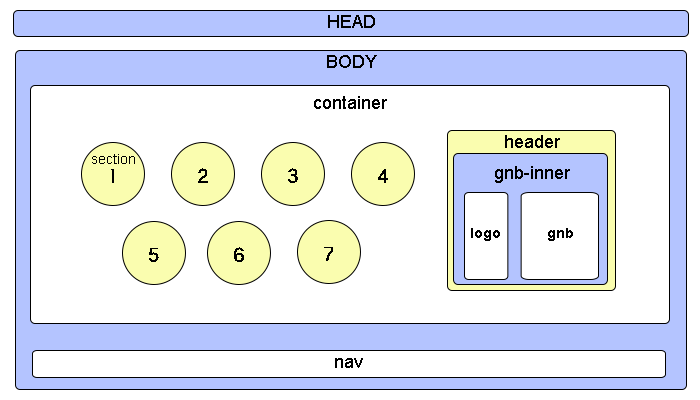
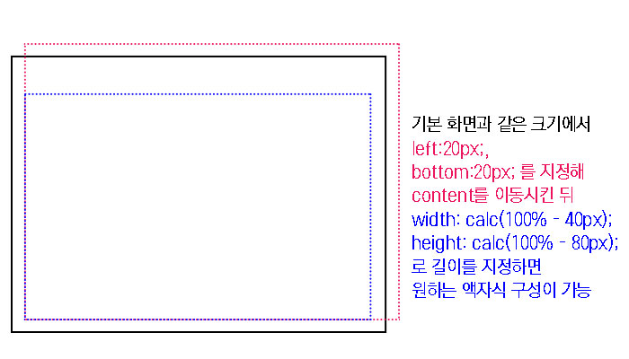

> 🎧 20.08.26 <br>
> 🧩 인프런 - HTML+CSS+JQUERY 반응형 웹사이트 포트폴리오 ([https://inf.run/2XLx](https://inf.run/2XLx))

# Ch 2. 전체 레이아웃 와이어프레임 퍼블리싱(PC ver.)

<br>

## <1> 기본서식

**body 구성하기**<br>
총 나타낼 화면 단위를 section으로 지정. 총 7개 section 확보 후, 화면의 헤더 부분 추가<br>
헤더 부분 안에는 헤더를 꽉 채우는 gnb-inner가 있고, gnb-inner는 왼쪽에 들어가는 logo, 오른쪽에 들어가는 gnb로 구성<br>

 <br>
<br>
gnb는 menu와 slogan 두 가지로 구성<br>
이 중 menu는 네비게이션으로 PC버전에서는 보이지 않게 할 예정이기에 display:none;을 적용시킬 것<br>
<br><br>

**style.css 구성**<br>
1. Google Web Font 불러오기
2. 변하지 않는 요소, Reset CSS 설정하기
3. 기본 서식 Default CSS 설정하기

<br>

🍕 `box-sizing: border-box;` : div에 padding이 주어졌을 때에 상대픽셀에 영향주지 않게 함<br>
예시) div의 너비가 300이고 padding을 50주는 경우 왼쪽 오른쪽 각각 50씩 추가돼 총 너비 400이 되는 것이 아닌 300 유지하고 border 내부에서 padding이 조절됨<br>

<br><br><br>


## <2> 전체 레이아웃, 헤더 영역

**section 구분**<br>
body > (div)container > 7개의 (section)cd-section & header <br>
(section)cd-section > (div) > (div)content <br>
<br><br>

**Entire Layout 지정**<br>
전체적인 레이아웃 지정<br>
섹션들의 모습이 액자와 같이 양옆 위 아래에 하얀색 여백이 있도록 만들기 위해 Entire Layout을 설정<br> 

```css
.content {
  background-color: #ddd;
  position: absolute;
  width: calc(100% - 40px);
  height: calc(100% - 80px);
  left: 20px;
  bottom: 20px;
}
```

🍕 `width: calc(100% - 40px);` : 각자 다른 단위를 연산하기 위해서는 calc 사용<br>
100%에서 위20px 아래20px을 뺌<br>

 <br>

<br><br>

**Header 모바일 네비게이션 구조 퍼블리싱**<br>
순차적으로 header, gnb-inner, logo, gnb, menu, menu a, slogan로 나눠 지정<br>
logo는 왼쪽, gnb는 오른쪽에 배치할 것이므로 float 설정<br>
menu는 PC버전에서 보이지 않게 할 것이므로 display: none; 설정<br>

<br><br>

**제작된 와이어프레임에 임시 이미지 넣기**<br>
section1에 임시 이미지를 넣어 제대로 작동하는지 확인<br>

🍕 `overflow: hidden;` : 길이나 너비에서 넘친 부분을 가려주는 역할<br>
<br>
 <br>
