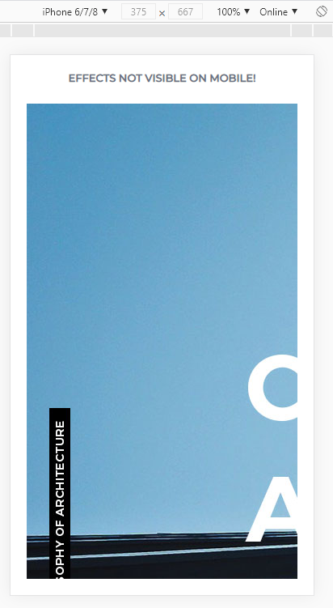
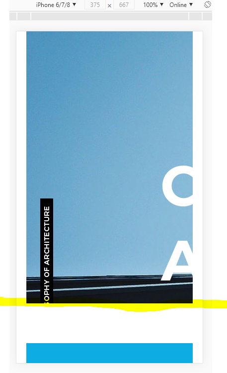
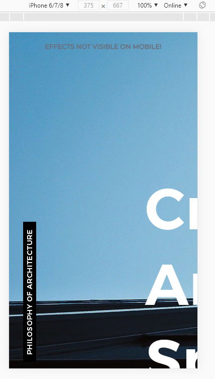
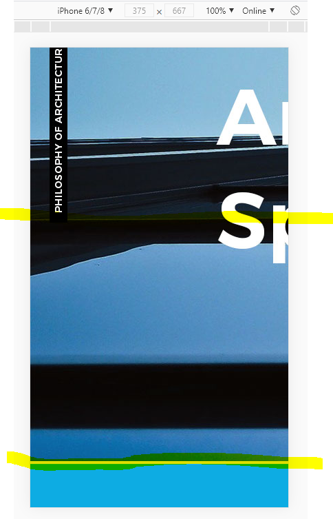

> 🎧 20.08.28 <br>
> 🧩 인프런 - HTML+CSS+JQUERY 반응형 웹사이트 포트폴리오 ([https://inf.run/2XLx](https://inf.run/2XLx))

# Ch 3. 모바일 전체 레이아웃 및 네비게이션 퍼블리싱(Mobile ver.)

<br>

## <1> Media Query

HTML. CSS. JQuery 사용<br>
반응형을 구현하기 위해 *responsive.css* 사용<br>
PC형 / 태블릿형 / 모바일형 세가지로 나누는 것이 보편적이고 여기서는 PC / 모바일 두가지만 구현할 예정<br>
<br>

🍕 크기에 해당할 때에만 실행하도록 하는 형식<br>
```css
@media (크기) {
  내용 blah blah
}
```
PC버전 크기 => `min width: 1074px;` 최소 너비 규정<br>
mobile버전 크기 => `max width: 768px;` 최대 너비 규정<br>

<br><br>

**Entire Layout**
PC버전에서는 액자구성을 했지만 mobile버전에서는 이미지가 화면에 가득 차도록 연출 하려고 함<br>
<br>
🍕 css에서의 길이 단위<br>
auto : 기본값. 많으면 많은대로 늘어나고 적으면 적은대로 줄어듬<br>
vh/vw : viewport(보이는 화면) height/weight. 상대적 길이<br>
<br>
100vh는 딱 화면에 맞는 크기로 맞춰지는 것이므로 모바일에서는 꼭 필요할 때만 사용<br>
section에 vh를 이용하면 모바일 크기에 맞춰서 일부가 잘려나가므로 auto로 수정해줌<br> 
그리고 위치도 맞게 수정<br>
<br>
🍕 position<br>
`position : absolute;` : 좌상단을 기준으로 한 절대위치<br>
부모나 조상에 position: absolute;가 있으면 그 요소가 기준이고 아무것도 없으면 창 기준<br>
`position : relative;` : 주로 absolute요소의 기준을 설정할 때 그 부모로 사용<br>
`position : fixed;` : 기준을 바꿀 수 없는 코드. 주로 창을 기준으로 띄우는 팝업 레이어에 사용<br>
`position : static;` : 기본값. absoulte나 fixed 요소를 원래 위치로 오게함<br>

<br><br>

  <br>
responsive.css 수정 전, 이미지가 아래로 잘린 모습<br><br>
  <br>
responsive.css 수정 후, 이미지가 아래로 잘리지 않고 나온는 모습<br>
