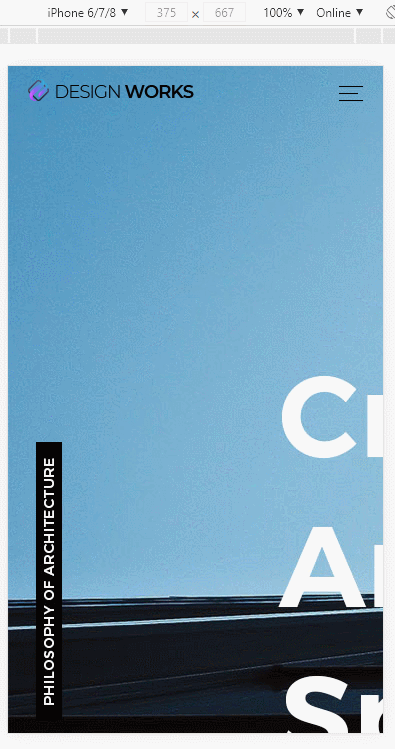

> 🎧 20.08.28 <br>
> 🧩 인프런 - HTML+CSS+JQUERY 반응형 웹사이트 포트폴리오 ([https://inf.run/2XLx](https://inf.run/2XLx))

# Ch 3. 모바일 전체 레이아웃 및 네비게이션 퍼블리싱(Mobile ver.)

<br>

## <1> Media Query

HTML. CSS. JQuery 사용<br>
반응형을 구현하기 위해 *responsive.css* 사용<br>
PC형 / 태블릿형 / 모바일형 세가지로 나누는 것이 보편적이고 여기서는 PC / 모바일 두가지만 구현할 예정<br>
<br>

🍕 크기에 해당할 때에만 실행하도록 하는 형식<br>
```css
@media (크기) {
  내용 blah blah
}
```
PC버전 크기 => `min width: 1074px;` 최소 너비 규정<br>
mobile버전 크기 => `max width: 768px;` 최대 너비 규정<br>

<br><br>

**Entire Layout**
PC버전에서는 액자구성을 했지만 mobile버전에서는 이미지가 화면에 가득 차도록 연출 하려고 함<br>
<br>
🍕 css에서의 길이 단위<br>
auto : 기본값. 많으면 많은대로 늘어나고 적으면 적은대로 줄어듬<br>
vh/vw : viewport(보이는 화면) height/weight. 상대적 길이<br>
<br>
100vh는 딱 화면에 맞는 크기로 맞춰지는 것이므로 모바일에서는 꼭 필요할 때만 사용<br>
section에 vh를 이용하면 모바일 크기에 맞춰서 일부가 잘려나가므로 auto로 수정해줌<br> 
그리고 위치도 맞게 수정<br>
<br>
🍕 position<br>
`position : absolute;` : 좌상단을 기준으로 한 절대위치<br>
부모나 조상에 position: absolute;가 있으면 그 요소가 기준이고 아무것도 없으면 창 기준<br>
`position : relative;` : 주로 absolute요소의 기준을 설정할 때 그 부모로 사용<br>
`position : fixed;` : 기준을 바꿀 수 없는 코드. 주로 창을 기준으로 띄우는 팝업 레이어에 사용<br>
`position : static;` : 기본값. absoulte나 fixed 요소를 원래 위치로 오게함<br>

<br><br>

<br>
responsive.css 수정 전, 이미지가 아래로 잘린 모습<br><br>
<br>
responsive.css 수정 후, 이미지가 아래로 잘리지 않고 나오는 모습<br>

<br><br><br>

## <2> 기본구조 및 링크 만들기

```html
	<header>
      <div class="gnb-inner">
        <div class="logo">
          <a href="#none"></a>
        </div>
        <div class="gnb">
          <div class="menu">
            <a href="#none">Home</a>
            <a href="#none">About</a>
            <a href="#none">Project</a>
            <a href="#none">Plan & History</a>
            <a href="#none">Awards</a>
            <a href="#none">Location</a>
            <a href="#none">Contact</a>
          </div>
          <div class="slogan">We design palces, not projects.</div>
        </div>
      </div>  
    </header>
```
header > gnb-inner > logo(이미지) 랑 gnb <br>
gnb > menu(네비) 랑 slogan(문구) <br>
menu > a링크들<br>
<br><br>

**gnb 보이기**<br>
PC버전에서는 menu 안보이고 slogan 보이고 (*style.css*) <br>
```css
.gnb {
  float: right;
}
.menu {
  display: none;
}
.slogan {
  font-size: 16px;
  font-style: italic;
}
```
<br>
<br>
mobile버전에서는 menu 보이고 slogan 안보이고 (*responsive.css*) <br>
```css
  .menu {
    display: block;
  }
  .slogan {
    display: none;
  }
``` 
<br>
정리하자면 모바일 화면(*responsive.css*)에서는 gnb를 꾸미는 것이 menu를 꾸미는 것과 동일. slogan은 신경쓰지 않는다<br>
<br><br><br>


## <3> 모바일 네비게이션

**모바일 네비게이션 구성하기**<br>
(1) gnb-inner 안에 div trigger 추가<br>

=> 메뉴를 튀어나오게 하는 **≡**(햄버거 버튼) 가 될 예정<br>
<br>

즉, gnb-inner 안에 logo와 gnb(menu), trigger(≡) 세가지가 존재<br>
logo는 논외로 두고 (항상 왼쪽에 있음)<br>
햄버거 버튼(≡)을 누르면(active) gnb(menu)가 튀어나오게 설정할 것<br>
<br><br>

(2) 햄버거 버튼을 눌렀을 때 튀어나올 gnb(menu)를 꾸밈<br>
🍕 display<br>
`display: block;` : 블록으로 처리한다 말하며, 상하로 배치<br>
`display: inline;` : 글자로 취급하여 좌우로 배치<br>
`display: inline-block;` : 글자와 블록의 특성을 모두 가짐<br>
<br><br>

(3) 햄버거 버튼 제작<br>
PC에서는 `display: none;` Mobile에서는 `display: block;`<br>
≡ 모양을 만들어 낼 때 span을 이용하는데, 임시로 trigger 상자에 border를 주고 작업하면 더 쉽게 눈으로 보면서 할 수 있음<br>
<br>
<br><br>
<br>


**모바일 네비게이션 jquery 구성하기 (active)**<br>
햄버거 버튼을 누르면<br>
(1) 햄버거 버튼 모양 -> X모양 변화<br>
(2) 숨겨져 있던 네비게이션이 오른쪽에서 나타나도록<br>
햄버거 버튼을 다시 누르면 네비게이션이 다시 사라지는데<br>
(3) 네비게이션 바깥, 섹션을 누르는 경우에도 네비게이션이 들어가도록<br> 
```js
/* Trigger */
$(function(){
  $('.trigger').click(function(){
    $(this).toggleClass('active') /* (1) */
    $('.gnb').toggleClass('active') /* (2) */
  })
  $('section').click(function(){
    $('.gnb').removeClass('active')
  }) /* (3) */
})
```
<br>

🍕 html내 script 경로 지정 위치
```js
$(function(){
	...
})
```
script 경로 지정(ex. `<script src="custom.js"></script>`)이 html문서 상단(head 내부)에서 이루어졌다면, js파일을 먼저 읽어버리고 사라진 뒤 html문서 body가 실행됨<br>
즉, 작성한 jquery 구문을 html에 적용하지 못함<br>
이를 막기 위하여 html문서를 처음부터 끝까지 한바퀴 다 읽고 나서 실행해!라고 지정하는 `$(function(){})`를 작성하고 이 안에 jquery구문을 작성하도록 함<br>
body 내부 가장 아래쪽에 script 경로 지정을 한다면 이를 사용하지 않아도 됨<br>
<br><br>

 <br>
