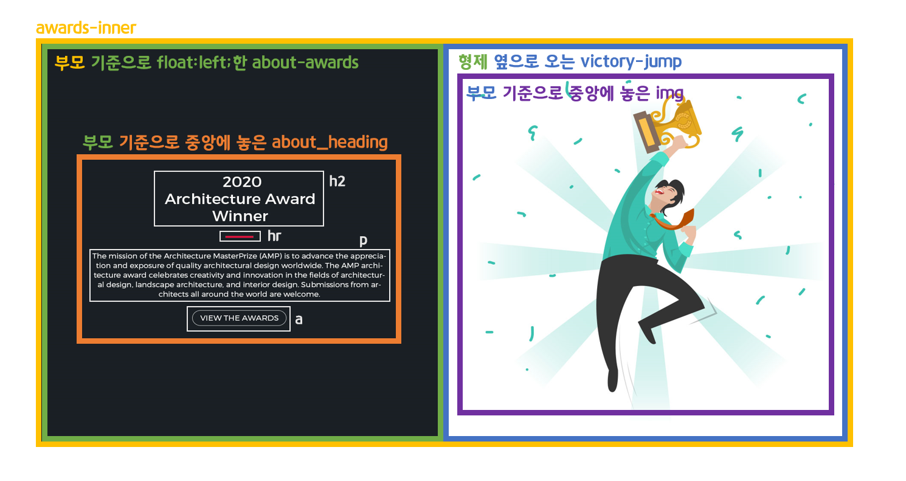
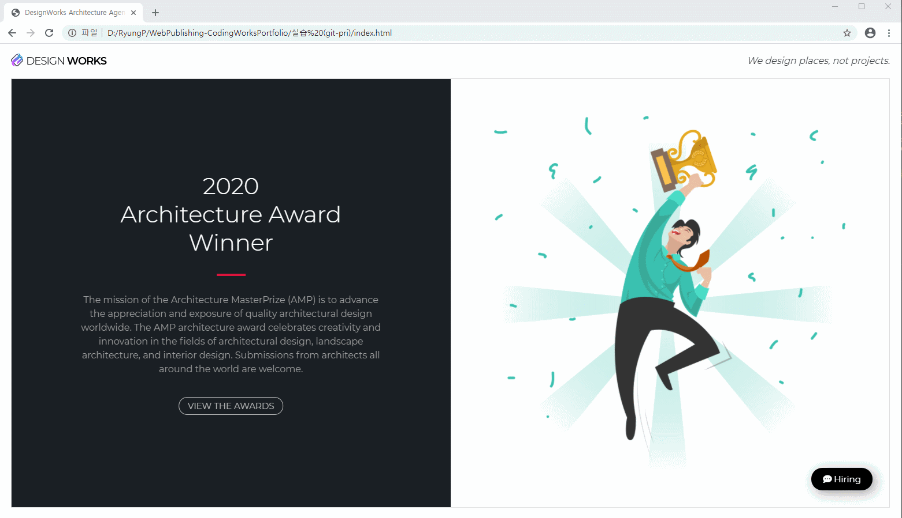

> 🎧 20.09.15 <br>
> 🧩 인프런 - HTML+CSS+JQUERY 반응형 웹사이트 포트폴리오 ([https://inf.run/2XLx](https://inf.run/2XLx))

# Ch 4. 섹션 상세 퍼블리싱(Awards Section)

<br>

## <1> HTML. CSS

Awards 섹션의 기본구조를 만듦<br>
<br>
<br><br>

🍕 자식의 `height:100%;`<br>
부모요소의 높이 값이 auto인 상태(따로 지정하지 않은 상태)에서 자식에서 height: 100% 지정해봤자 부모요소가 가진 만큼만 늘어나는 것. 자식요소도 100%로 늘어나기 위해서는 부모도 100%로 지정해줘야 함<br>
<br>

🍕 자식 선택자 `>`<br>
`.부모div 자식div { }` : 부모div 아래에 있는 자식div를 포함한 모든 후손div들 해당<br>
`.부모div > 자식div {}` : 부모div 아래에 있는 자식div만 해당<br>
<br>
자식 선택자를 Awards 섹션에 적용해서 다시 보자면<br> 
`.awards-inner > div { }`는 바로 아래 자식인 about_awards와 victory_jump에만 영향을 주지만 `.awards-inner div { }` 는 후손들, 즉 about_awards의 자식인 about_heading에게 까지도 영향을 줌<br>
`width: 50%;` 이 총 3개의 div에 영향을 주어 about_awards가 마치 25%를 차지한 것 처럼 보이게 함<br>
<br>

<br>
<br><br>

🍕 이미지 넣는 방법 선택하기<br>
(1) 그냥 이미지로 넣기 (html에서 img 태그를 사용하여 이미지 삽입)<br>
 : 태그 하나로 끝낼 수 있어서 더 간편하기 때문에 이미지 하나만 넣는 경우에 사용하기 좋음<br>
(2) 배경 이미지로 넣기 (css에서 이미지 삽입)<br>
 : 이미지 위에 텍스트 컨텐츠를 얹는 경우에 사용하기 좋음<br>
<br><br>

🍕 부모 컨텐츠를 기준으로 정중앙 배치<br>
```css
  position: absolute; /* 부모로 기준 잡기 */
  top: 50%; /* 전체 높이 반만큼 아래로 이동 */
  left: 50%; /* 전체 너비 반만큼 오른쪽으로 이동 */
  transform: translate(-50%, -50%); /*  도형의 크기 50%만큼씩 왼쪽상단으로 이동*/
```
<br>

`position: absolute;` 한 콘텐츠는 인라인요소가 되므로 크기가 내용물에 맞게 조정됨<br>
따라서 원하는 만큼 크기를 조절하려면 width나 height를 이용하여 아래에 이어서 작성하면 됨<br>
<br><br>

**VIEW THE AWARDS 버튼**<br>
(1) 마우스 올렸을 때 효과<br>
가상클래스 `:hover`를 줘서 색이 바뀌는 효과와 경계선(border)이 없어지는 효과를 줌<br>
경계선을 없애는 과정에서 `border: none;`을 주면 살짝 부자연스러운 부분이 있는데 이는 `border: transparent;`를 이용하면 자연스럽게 연출 할 수 있음<br>
<br>
(2) 위에 여백 주기<br>
VIEW THE AWARDS 버튼과 위에 위치한 요소 p태그(텍스트) 사이에 여백을 줌<br>
VIEW THE AWARDS 버튼은 a태그, 즉 인라인요소. margin값을 줄 수 없음. 그래서 다른 요소들을 이용해 여백을 만들어낼 수 있는데, 첫번째 방법은 바로 위에 위치하는 요소 p태그에 margin값을 주는 방법. p태그는 블럭요소이기 때문에 margin값을 줄 수 있음. 두번째 방법은 a태그를 `display: inline-block;` 해주고 margin값을 주는 방법. 이 경우 상하좌우에 전부 margin값을 줄 수 있기 때문<br>
<br><br>

Awards Section 완성<br>
 <br>
