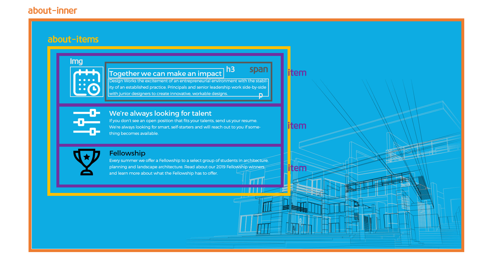
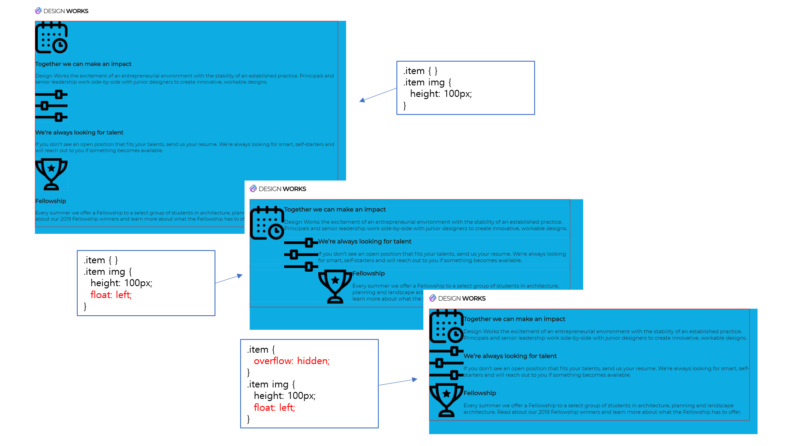
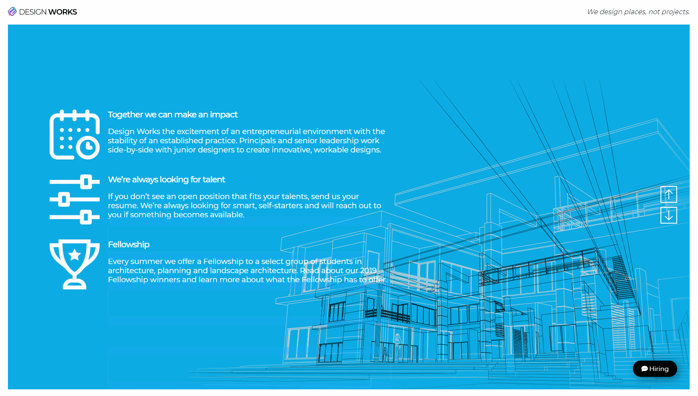

> 🎧 20.09.17 <br>
> 🧩 인프런 - HTML+CSS+JQUERY 반응형 웹사이트 포트폴리오 ([https://inf.run/2XLx](https://inf.run/2XLx))

# Ch 5. 섹션 상세 퍼블리싱(About Section)

<br>

## <1> HTML. CSS

About 섹션의 기본구조를 만듦<br>
<br>
<br><br>

css를 이용해서 배경에 이미지를 넣기 위해서는
```css
.about-inner {
  background: #0dace3 url(images/line-drawing.png) no-repeat right bottom:
  height: 100%; 
}
```
 `background: 배경색상 url(이미지) 반복유무 좌우 상하;` 를 이용해 지정 (색상은 `background-color: #0dace3;` 으로 따로 빼서 지정할 수 도 있음)<br>
그리고 about-inner에 높이 값을 지정해주지 않으면 배경이 설정되지 않기 때문에 `height: 100%;`를 잊지 말 것<br>
배경 이미지의 크기를 조절하고 싶은 경우에는 `background-size: 80%;`와 같이 따로 지정<br>
<br>
<br>
<br>
🍕 One True Layout 방식<br>
`overflow:hidden;`과 float 속성을 함께 사용하여 레이아웃을 구성하는 방법<br>
float의 원래 용도는 이미지를 글자와 어우러지게 만들기 위해 사용된 것으로, float 속성을 적용한 요소가 제대로 배치되지 않았을 경우 부모요소에 `overflow:hidden;` 속성을 주어 레이아웃을 자리 잡게 함<br> 
<br>
하나의 item에는 img, span 두가지 요소가 존재하는데 이 둘을 옆으로 나란하게 배치하기 위하여 `float:left;`를 주는데 item은 총 3개가 존재, float이 중복으로 계속 일어나 계단식 형태가 됨<br>
이를 위해 item에 `overflow:hidden;` 을 주어 (아래로 넘친 여백을 없앰) 아래에 바로 다음 item이 위치할 수 있도록 조정<br>
<br>
<br>
🍕 `filter: invert(1);`<br>
= `filter: invert(100%);` = 색상 (완전) 반전<br>
기존에 검정색이던 이미지를 하얀색으로 변화시키는 방법<br>
<br>
여기에서는 평소에는 하얀색(반전)이다가 마우스가 hover되면 검정색(원본)으로 변화하는 모습을 연출하기 위해 사용<br>
<br>
<br>
.item h3 {} 에 `margin:0;`을 따로 지정하는 이유는 h태그에 자체적으로 margin값이 있어 텍스트 위에 공백이 생기기 때문. 이를 없애주는 역할을 함<br>
<br><br>

**색상 반전**<br>
item에 마우스를 올리면 img(이미지)와 h3(제목)이 흰색에서 검정색으로 변화하도록<br>
img는 참고로 원본이 검정색이였기 때문에<br>
 `filter: invert(1);` : 100%반전 : 흰색<br>
 `filter: invert(0);` : 원본 : 검정색<br>
 즉 invert 값이 1에서 0으로 변해야 함<br>
<br>
`.item:hover{}`로 지정하면 item에 마우스를 올렸을 때는 맞지만 변화하는 주체도 item이 됨. 그러므로 `.item:hover img{}`, `.item:hover h3{}` 두개를 작성해야 함<br>
```css
.item { ... }
.item:hover img {
  filter: invert(0);
}
.item:hover h3 {
  color: #000;
}
.item img {
  filter: invert(1);
  transition: 0.5s;
}
.item h3 {
  transition: 0.5s;
}
```
<br><br>

About Section 완성<br>
 <br>
