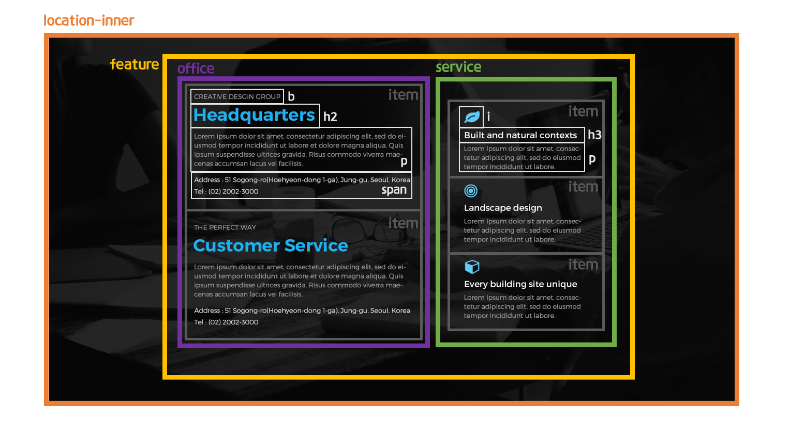

> 🎧 20.09.20  
> 🧩 인프런 - HTML+CSS+JQUERY 반응형 웹사이트 포트폴리오 ([https://inf.run/2XLx](https://inf.run/2XLx))

# Ch 6. 섹션 상세 퍼블리싱(Location Section)

 

## <1> HTML. CSS

Location 섹션의 기본구조를 만듦 
 
  

 🍕 가상클래스 `:before` `:after` 
 요소 앞(뒤)에 콘텐츠를 추가할 때 사용함. 앞/뒤는 크게 상관이 없음 
 반드시 content 요소와 함께 사용해야하며 content는 html에서 포함되지 않은 정보를 css에 추가할 때 그 내용을 말함. 따로 추가하는 텍스트가 없을 경우에는 `content: '';`으로 대체 
 
`location-inner:before{}`는 콘텐츠(배경이미지)를 어둡게 연출하기 위해 앞에 검정색 반투명 박스를 놓기 위해 사용. 따라서 따로 텍스트가 추가되는 것은 없기 때문에  `content: '';`으로 시작해 `background-color: rgba(0, 0, 0, 0.85);`로 마무리 함 
 
