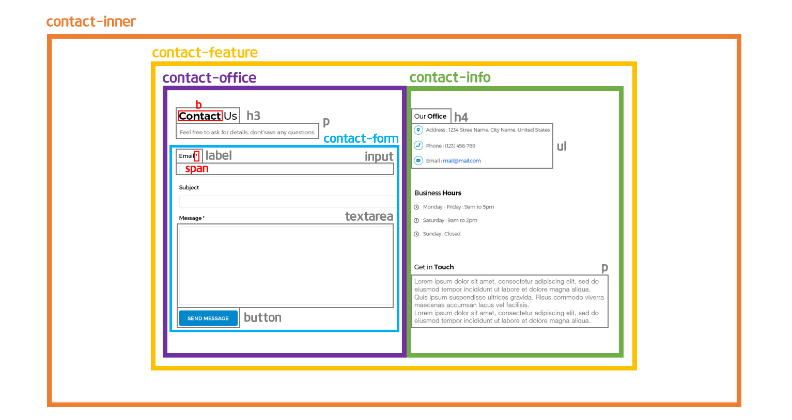
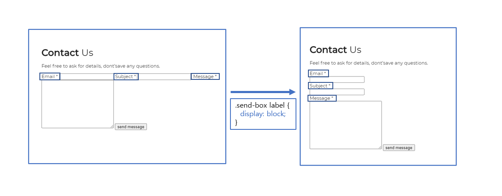
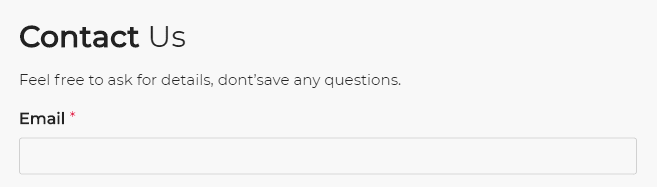
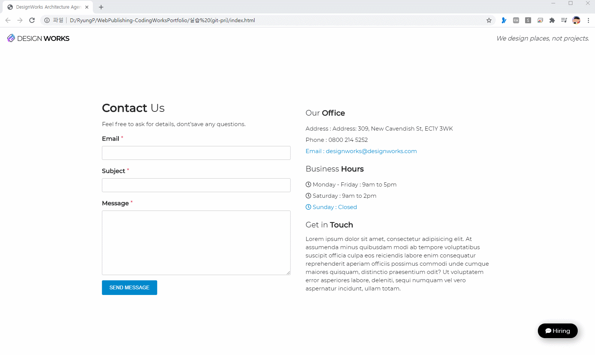

> 🎧 20.09.21 <br>
> 🧩 인프런 - HTML+CSS+JQUERY 반응형 웹사이트 포트폴리오 ([https://inf.run/2XLx](https://inf.run/2XLx))

# Ch 7. 섹션 상세 퍼블리싱(Contact Section)

<br>

## <1> HTML. CSS

Contact 섹션의 기본구조를 만듦<br>
<br>
<br><br>

바로 직전에 작업한 Location과 기본 구성이 비슷하기에 참고하며 작업<br>
<br><br>

🍕 button 태그<br>
이전까지는 다른 input요소들 처럼 button을 생성할 때 `<input type="button" value="버튼"></input>` 형식을 사용했으나 html5부터 button이라는 태그가 따로 등장했으므로 `<button>버튼</button>`으로 사용 가능<br>
이전에는 before after 속성을 가질 수 없었으나 button으로 태그가 분리된 이후부터는 가질 수 있게 됨. 즉, 꾸밀 수 있는 영역이 확장됨<br>

<br><br>
폼 요소들이 한 줄로 예쁘게 정렬시키기 위해서 label에 `display: block;`을 설정.<br>
블록으로 처리되면 상하로 배치, 즉 양옆에 다른 요소 없이 한 줄에 단독으로 배치된다는 것. label만 블록처리되면 label들 사이에 위치한 input요소들(인라인요소)도 단독으로 배치 가능해짐을 이용.<br>
<br>
<br><br>
<br>


**form요소 꾸미기**<br>
input의 속성에 따라 달리 선택하여 스타일을 줄 경우에는 아래처럼 서식 지정<br>
```html
<input type="email">
<input type="text">
```
```css
.send-box input[type=email] {}
.send-box input[type=text] {}
```
<br><br>

`outline: none;` : html에서 form요소는 마우스로 한 번 클릭했을 때 테두리가 진하게 변하는 기본 속성이 있음. 이를 없애기 위해(클릭해도 변화 없게)서 이용<br>
<br><br>

버튼에 마우스를 올렸을 때 변화를 두가지 연출<br>
(1) 커서를 손가락모양(👆)으로 변화 : `cursor: pointer;`<br>
(2) 버튼 색상 변경 : `background-color: #000;`<br>
<br>
주의할 점은 (2)의 경우 `:hover` 가상선택자를 이용하여 지정하지만 (1)은 가상선택자를 사용하지 않고 지정 가능함<br>

```css
button {
  cursor: pointer;
  transition: 0.5s;
}
button:hover {
  background-color: #000;
}
```
<br>
(3) form요소에(email, text, textarea) hover&focus effect<br>
입력하기 위해서 요소위에 마우스를 올리면(hover) 하늘색 테두리가 생기게, 요소를 선택한 후(focus)에는 폼요소의 배경색을 바꾸어 무엇을 작성 중인지 눈에 잘 보이도록 함<br>

참고로 요소를 선택하기 전과 후에 같은 효과를 주고 싶을 때, `:hover`에만 설정을 하면 마우스를 누른 후에는 이펙트가 풀려버림을 인지, `:focus`에도 적용해주는 것을 기억할 것<br>

```css
.send-box input[type=email],
.send-box input[type=text],
.send-box textarea {
  transition: 0.5s;
}
.send-box input[type=email]:hover,
.send-box input[type=text]:hover,
.send-box textarea:hover {
  border: 1px solid #0088cc;
  box-shadow: 0 0 5px #0088cc;
}
.send-box input[type=email]:focus,
.send-box input[type=text]:focus,
.send-box textarea:focus {
  background-color: #eee;
}
```
<br>
<br>

🍕 `:hover`, `:active`, `:focus` <br>
`:hover` : 마우스를 개체에 올려놓았을 때 상태를 지정하기 위해서 사용함<br>
`:active` : 마우스로 개체를 클릭하고 있는 중의 상태를 지정하기 위해서 사용함<br>
`:focus` : 마우스로 개체를 클릭하고 나서의 상태를 지정하기 위해서 사용함<br>
 ⁕ 속성 작성 시 hover -> active -> focus 순으로 지정<br>
만약 active를 생략하여도 focus가 지정된다면 클릭을 누르는 찰나의 순간에 공백없이 효과가 지정됨<br>
<br><br>
<br>


오른쪽 contact-info의 요소 중 Our Office 와 Business Hours의 리스트 마지막 요소만 파란색 글씨 설정<br>
이는 span 태그로 따로 감싸서 스타일 지정할 수 있지만 둘 다 마지막 요소라는 공통점이 있기 때문에 구조 선택자 `:last-child`를 사용하여 꾸며줌<br>
<br>
🍕 구조 선택자<br>
`:first-child` : 형제 관계에서 첫번째로 등장하는 태그 선택<br>
`:last-child` : 형제 관계에서 마지막으로 등장하는 태그 선택<br>
`:nth-child(n)` ; 형제 관계에서 앞에서부터 n번째 태그 선택<br>
`:nth-last-child(n)` 형제 관계에서 뒤에서부터 n번째 태그 선택<br>
<br><br>

Contact Section 완성<br>
 <br>
