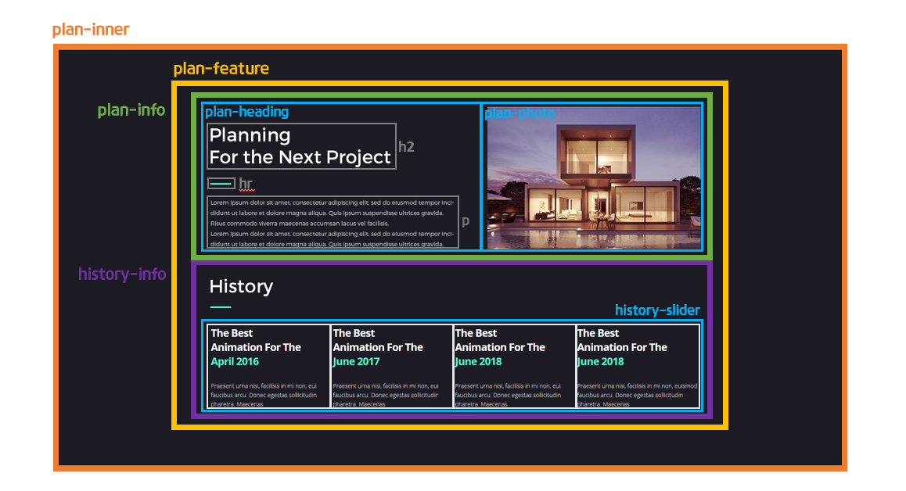
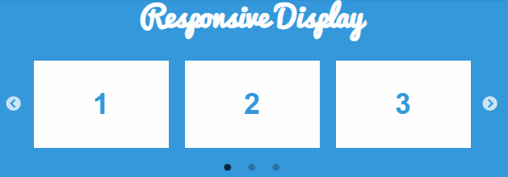

> 🎧 20.09.24 <br>
> 🧩 인프런 - HTML+CSS+JQUERY 반응형 웹사이트 포트폴리오 ([https://inf.run/2XLx](https://inf.run/2XLx))

# Ch 8. 섹션 상세 퍼블리싱(Plan Section)

<br>

## <1> HTML. CSS

Plan 섹션의 기본구조를 만듦<br>
<br>
<br><br>

이제 이전에 만든 section들과 속성이 겹치는 경우가 생기는데 그 예시가 `<hr class="bar">`<br>
awards 섹션과 중복되는 클래스로 스타일시트가 아래쪽(awards섹션이 plan섹션보다 뒤에 등장)에 미리 지정되어 있음. 즉 다른 속성을 부여할 때 `hr.bar {}`로 새로 작성할 경우 뒤에서 다시 `hr.bar {}`가 나와 덮어쓰기하기 때문에 의미가 없어짐. 따라서 부모클래스를 이용하여 `.plan-heading hr.bar {}`로 구체적으로 지정.<br>

```css
/* ################ Section : plan ################ */
.plan-heading hr.bar {
  background-color: dodgerblue; /* hr색상 변화 */
  display: inline-block; /* 왼쪽 배치 */
}

/* ################ Section : awards ################ */
hr.bar {
  width: 50px;
  height: 4px;
  border: none;
  background-color: crimson;
  margin: 30px auto; /* 중앙 배치 */
}
```
🍕 중앙 배치를 해제하기 위해 사용한 `display: inline-block;`<br>
기본적으로 블록 요소(상하배치)인 hr은 아래 awards섹션에서 지정한 `margin: auto;`의 영향을 받아 중앙에 배치됨. plan 섹션에서는 hr을 중앙이 아닌 왼쪽에 배치하고 싶어하기 때문에 inline 요소로 변화. 하지만 inline요소는 높이 값을 가질 수 없어 배경색이 적용되지 않아 아예 없는 요소처럼 눈에 보이지 않음<br>
따라서 `margin: auto;`에 적용받지 않고 왼쪽에 배치되며 크기값을 가지게 하는 inline-block 요소로 지정<br>
plan 섹션의 hr만 골라 서식을 새로 지정해줬으므로 아래 awards 섹션의 hr은 여전히 블록요소. 추가 수정 없음<br>
<br><br>
<br>


## <2> Slick.js

slick.js 다운로드 : [https://kenwheeler.github.io/slick/](https://kenwheeler.github.io/slick/)<br>
<br><br>
<br>
```html
<link  rel="stylesheet"  type="text/css"  href="slick/slick.css"/>
<link  rel="stylesheet"  type="text/css"  href="slick/slick-theme.css"/>
<script type="text/javascript" src="slick/slick.min.js"></script>
```
```js
$('.클래스이름').slick({
  dots:  true, // 도트 네비게이션 보여주기
  infinite:  false, // 마지막 슬라이딩하면 처음으로. 무한반복
  speed:  300, 
  slidesToShow:  4, // 한 번에 4개 보여주기
  slidesToScroll:  4, // 4개 단위로 슬라이딩 하기

  /* 반응형 */
  responsive:  [
    {
      breakpoint:  1024, // PC
      settings:  {
        slidesToShow:  3,
        slidesToScroll:  3,
        infinite:  true, 
        dots:  true
      }
    },  
    {
      breakpoint:  600, // 태블릿
      settings:  {
        slidesToShow:  2, 
        slidesToScroll:  2  
      }  
    },  
    { 
      breakpoint:  480, // 모바일
      settings:  { 
        slidesToShow:  1, 
        slidesToScroll:  1
      }
    }
  ]
});
```
<br><br>
