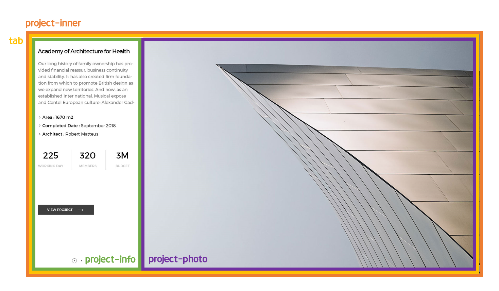
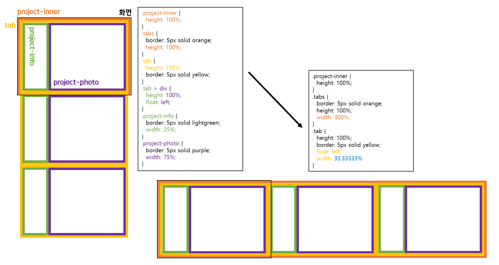
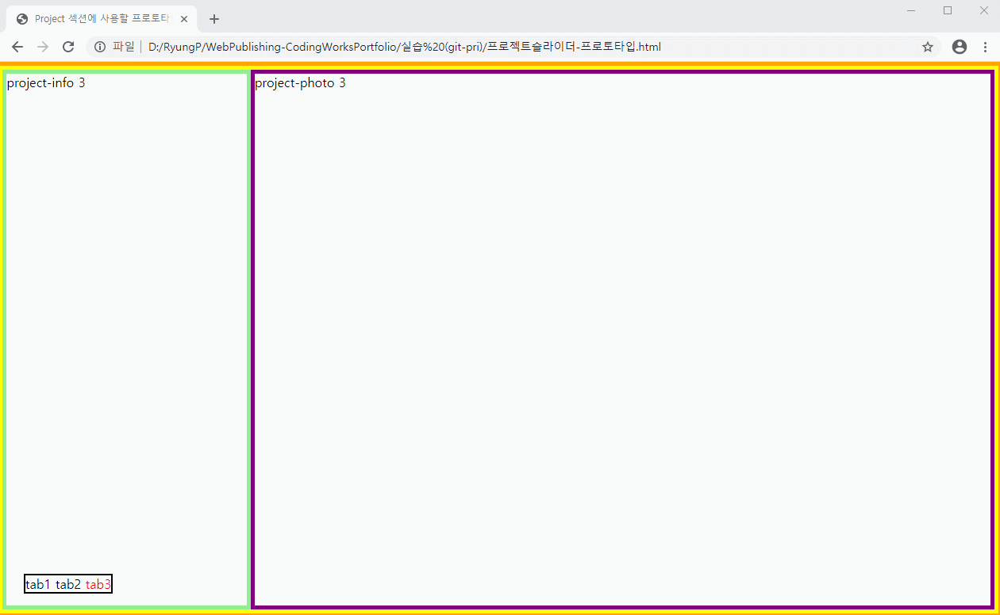
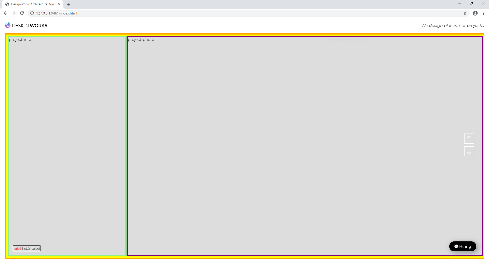

> 🎧 20.10.28 <br>
> 🧩 인프런 - HTML+CSS+JQUERY 반응형 웹사이트 포트폴리오 ([https://inf.run/2XLx](https://inf.run/2XLx))

# Ch 9. 섹션 상세 퍼블리싱(Project Section)

<br>

## <1> HTML. CSS

Project 섹션의 기본구조를 만듦<br>
<br>
<br>
tab은 총 3개가 들어가며 width, height 100%로 적용해 옆으로 슬라이드 되도록 만들 예정<br>
<br><br>
<br>


## <2> 프로토타입 제작

현재 프로젝트에는 섹션이 5개가 이미 완성된 상황. 즉 html과 css에 많은 양이 담겨진 상태이고, Project 섹션 역시 많은 양이 들어갈 예정이며 난이도 역시 높음<br>
그러므로 작업의 효율성을 위해 tab 부분을 기존 html과 css에 바로 적용하는 것이 아닌 따로 프로토타입으로 만들어 먼저 만들어 볼 것 => `프로토타입.html` 생성<br>
(원래 파일명에 한글은 사용하지 않음. 하지만 업로드 할 파일이 아니기 때문에 대충 작업할 때는 사용 가능)<br>
<br>
```html
<!DOCTYPE html>
<html lang="ko">
<head>
  <meta charset="UTF-8">
  <title>Project 섹션에 사용할 프로토타입</title>
  <style>
    .project-inner {}
    .tabs {}
    .tab {}
    .project-info {}
    .project-photo {}
  </style>
</head>
<body>
  <div class="project-inner">
    <div class="tabs">
      <div class="tab">
        <div class="project-info">
          project-info 1
        </div>
        <div class="project-photo">
          project-photo 1
        </div>
      </div>
      <div class="tab2">
        <div class="project-info">
          project-info 2
        </div>
        <div class="project-photo">
          project-photo 2
        </div>
      </div>
      <div class="tab">
        <div class="project-info">
          project-info 3
        </div>
        <div class="project-photo">
          project-photo 3
        </div>
      </div>
    </div>
  </div>
</body>
</html>
```
가로 스크롤되어 넘어갈 tab(화면)은 project-info와 project-photo 두가지로 구분<br>
그리고 tab은 총 3개로 구성되어 그들을 합한 것이 tabs가 됨<br>
<br><br>


(1) 가로 스크롤 페이지 만들기 (UI 만들기)<br>
<br>
섹션을 제대로 구분하며 작업하기 위해 각각에 border를 줌<br>
(위의 기본구조에서는 생략했으나 3개의 tab을 담아내기 위한 tabs가 존재<br>
그러므로 project-inner에 주황색 border값을 주는 것이 아닌 그의 자식인 tabs에 값을 전달)<br>
<br>
 <br>
<br>
tabs와 tab에 width를 따로 주지 않았을 경우 `width:100%;`가 디폴트로 적용되어 한 화면에 하나의 tab만 보여지게 됨<br>
나머지의 tab은 아래에 연달아 출력되어 아래로(세로) 스크롤 해야하는 형태가 됨<br>
<br>
이를 가로 스크롤로 만들기 위해 tabs에 `width:300%;`, 각 tab에 `width:33.33333%;`를 적용<br>
<br>
만약 tabs에 `width:300%;`, 각 tab에 `width:100%;`를 적용할 경우, tab이 상속받은 300%의 100%, 즉 300% 그대로를 받기 때문에 tabs와 tab의 너비가 동일하고 width를 주지 않았던 기본 상태와 동일해짐<br>
따라서 tabs안에 3개의 tab 나란히 나열하기 위해서는 tabs의 1/3크기인 33.33333%를 부여해야 맞음<br>
<br><br>


(2) input 속성 주기 (기능 만들기)<br>
<br>
```html
<body>
  <div class="project-inner">
    <input type="radio" name="tabmenu" id="tab1" checked>
    <input type="radio" name="tabmenu" id="tab2">
    <input type="radio" name="tabmenu" id="tab3">
    <div class="tabs">
      ...
    </div>
    <div class="btn">
      <label for="tab1">tab1</label>
      <label for="tab2">tab2</label>
      <label for="tab3">tab3</label>
    </div>
  </div>
</body>
```
<br>
project-inner 안에 들은 tabs의 위 아래로 radio버튼 3개와 btn을 추가. 즉 input 3개, tabs, btn 이 같은 계층으로 존재함<br>
radio를 눌렀을 때 라벨에 이벤트 전달을 하기 위해 

`input id="tab1"` 와 `label for="tab1"` 로 서로를 연결. 이후 radio버튼은 눈에 보이지 않도록 만들 예정인데, 서로 연결했기 때문에 안보여도 작동함<br>
<br>

이 때, radio 버튼은 항상 name이나 id를 가져야 하며 css를 지정할 때에는 이를 이용하는 속성 선택자를 사용<br>

🍕 속성 선택자 `input[속성=속성명] {}` <br>
`input[name=tabmenu] {}` : input이라는 태그 중에 name 속성값이 tabmenu인 것을 선택<br>
`input[id=tab] {}` :  input이라는 태그 중에 id 속성값이 tab인 것을 선택<br>
`label[for=tab1] {}` : label이라는 태그 중에 for 속성값이 tab1인 것을 선택<br>
<br><br>

```css
/* -----------radio 버튼이 보이지 않도록----------- */
input[name=tabmenu] {
  display: none;
}

/* -----------------btn 스타일 지정--------------- */
.btn {
  border: 2px solid #000;
  position: absolute;
  left: 30px;
  bottom: 30px;
}
.btn label {
  cursor: pointer; /* 커서를 올리면 손가락 모양 */
}

/* -------input 선택됐을 때 label 표시 효과------- */
input[id=tab1]:checked ~ .btn label[for=tab1] { 
  color: red;
}
input[id=tab2]:checked ~ .btn label[for=tab2] {
  color: red;
}
input[id=tab3]:checked ~ .btn label[for=tab3] {
  color: red;
}

/* -------input 선택됐을 때 tab 스크롤 효과------- */
input[id=tab1]:checked ~ .tabs {
  margin-left: 0;
}
input[id=tab2]:checked ~ .tabs {
  margin-left: -100%; /* 좌로 이동 */
}
input[id=tab3]:checked ~ .tabs {
  margin-left: -200%; /* 좌로 이동 */
}
```
<br>
앞서 3개의 radio버튼에 모두 같은 name과 각자 다른 id를 줬는데 name은 버튼을 보이지 않게 하는 것(공통 스타일)에 사용하고 id는 label과 연결이 가능하기 때문에 tab1, tab2, tab3 각기 다르게 지정하여 독립적으로 기능하게 함<br>
<br>

🍕 태그에 이름을 지정하는 `id` / `class` / `name` <br>
`id` : 중복된 값을 가지지 않음 (유일한 존재) (css에서는 문제없으나 jquery에서 문제가 발생할 수 있음). input태그를 제외한 다른 태그에서 사용되지 않음. css 식별자로 사용 가능<br>
`class` : 중복된 값을 가짐 (여러 요소 적용 가능). css 식별자로 사용 가능<br>
`name` : 중복된 값을 가짐 (여러 요소 적용 가능). css 식별자로 사용 불가능. JS 식별자로 사용 가능<br>
<br>
<br>

🍕 형제 선택자 `~`<br>
`형 ~ 동생 동생의자손 { }` : ~의 앞뒤는 같은 계층에 있는 형제가 등장해야 함<br> 
<br>

radio버튼을 누른 경우 label의 스타일을 지정하도록 만드는데, radio 버튼과 형제인 요소는 btn이기 때문에 `~` 다음에 바로 label을 부르는 것이 아닌 `.btn label`로 호출 (`input[id=tab1]:checked ~ .btn label[for=tab1] { color: red; }`)<br>
<br>
위에서 radio와 label을 `id=tab1`, `for=tab1`로 서로 연결했기 때문에 눈에 보이지 않는 radio를 누르는 것이 아닌 육안으로 확인 가능한 label을 누르는 것이 됨<br>
따라서 label인 tab1, tab2, tab3를 각각 누르면 색상변화와 스크롤 이동이 가능해짐<br>
<br>
<br><br>

프로토타입 완성<br>
 <br>
<br><br>


## <3> 탭 콘텐츠 퍼블리싱

이제 프로토타입을 section3으로 옮겨옮<br>
<br>
<br>
project-photo에는 대신에 사진을 넣고, project-info에는 대신에 정보를 입력<br>

(1) 왼쪽 하단 슬라이더 라벨 디자인<br>
btn label에 . 을 표현<br>
<br>
(2) 왼쪽 텍스트(정보, project-info) 넣기<br>
<br>
🍕 Font Awesome 이용해서 icon 넣기<br>
[Font Awesome 4.7.0 Bootstrap](https://fontawesome.bootstrapcheatsheets.com) : 그냥 폰트어썸 공식사이트 이용하는 것 보다 간편<br>
(1)  html 태그로 아이콘 넣기<br>

```html
<!-- Font Awesome -->
<script src="https://kit.fontawesome.com/aee48569cb.js" crossorigin="anonymous">

<li><i class="fa fa-angle-right"></i></li>
```
html 태그가 지저분해지는 단점이 있음<br>
(2) 유니코드 이용해서 css 영역에 아이콘 넣기<br>

```css
/* FontAwesome CDN 4.7 */
@import url('https://stackpath.bootstrapcdn.com/font-awesome/4.7.0/css/font-awesome.min.css');

li:before {
    content: "\f105";
    font-family: fontawesome;
}
```
조금 더 깔끔함<br>
<br>

🍕 가로배치<br>
`float: left;` : 1px도 틀리지 않고 정교하게 작업할 때<br>
`display: inline-block;` : 정교할 필요 없고 가로배치 정도만 필요할 때<br>
<br><br>

(3) slick.slider(이미지, project-photo) 넣기<br>
<br>
