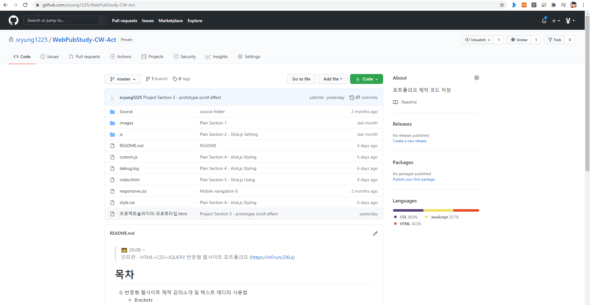

> 👑  20.08 ~  
> 인프런 - HTML+CSS+JQUERY 반응형 웹사이트 포트폴리오 ([https://inf.run/2XLx](https://inf.run/2XLx))

# 목차
0. 반응형 웹사이트 제작 강의소개 및 텍스트 에디터 사용법
   - Brackets
   - VS  Code
1. 전체 레이아웃을 제어하는 플러그인 사용법 빛 사용자 설정
   - Page Scroll Effects
2. 전체 레이아웃 와이어프레임 퍼블리싱(PC ver.)
   - 전체적인 구조 (header / section / nav)
3. 모바일 전체 레이아웃 및 네비게이션 퍼블리싱(Mobile ver.)
   - Media Query
   - 모바일 내비게이션 + 섹션

> 섹션 작업 시, 상대적인 난이가 낮은 순으로 시작할 것 추천 
> 5.Awards > 2.About > 6.Location > 7.Contact > 4.Plan > 3.Project > 1.Home

4. Awards Section
   - 가로배치와 포지셔닝, 배경이미지 대신에 img를 사용하는 팁
5. About Section
   - 배경이미지, 호버이펙트, CSS filter 속성 활용
6. Location Section
   - 폰트어썸 활용한 디자인, 가상클래스 before로 오버레이 배경 디자인
7. Contact Seection
   - 폼(form) 요소 다루기, 폼 요소에 쓰이는 가상클래스 :hover :focus
8. Plan Section
   - 제이쿼리 슬라이더 플러그인 Slick.js 활용, Custome CSS로 디자인 변경
9. Project Section
   - 순수 CSS 탭 콘텐츠 슬라이더, 제이쿼리 이미지 슬라이더 Slick.js 
10. Home Section 
    - CSS 키프레임 애니메이션

 

# 실습
private 레파지토리에 따로 실습 중 
[https://github.com/sryung1225/WebPubStudy-CW-Act](https://github.com/sryung1225/WebPubStudy-CW-Act)
 
